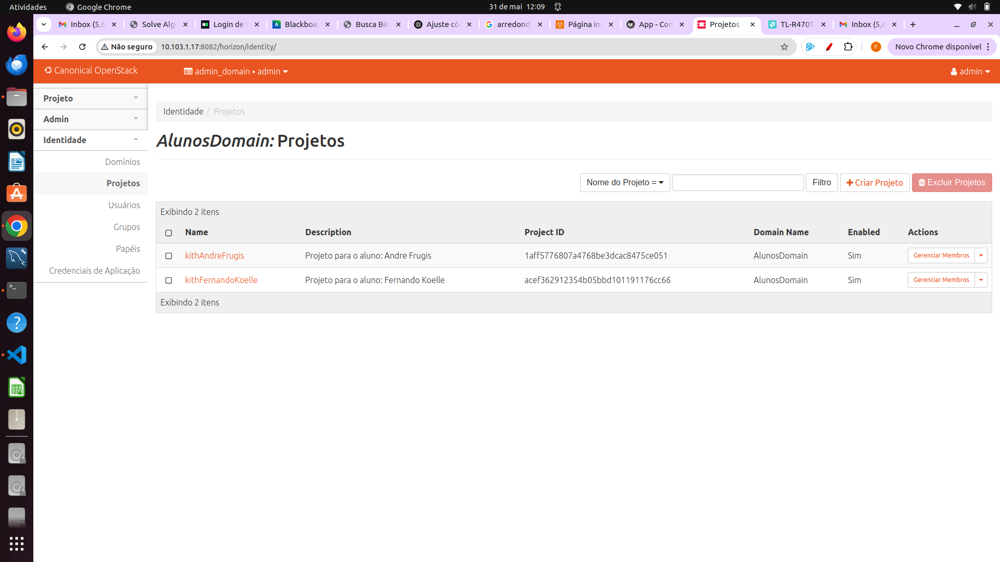
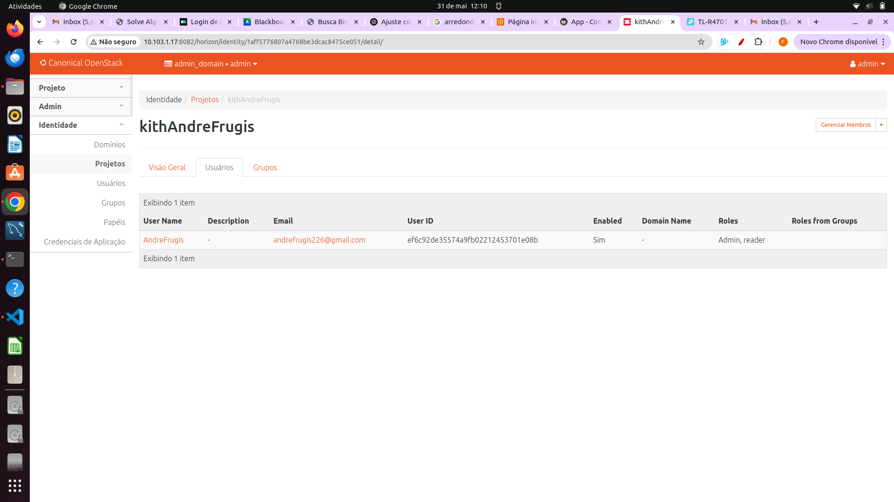
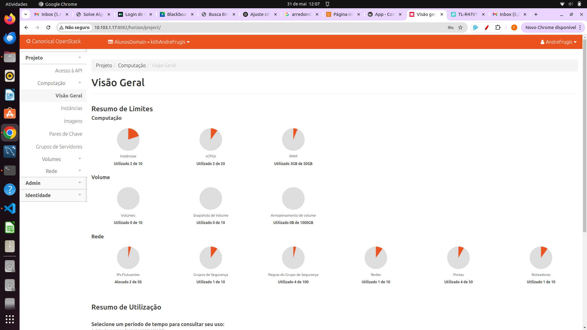
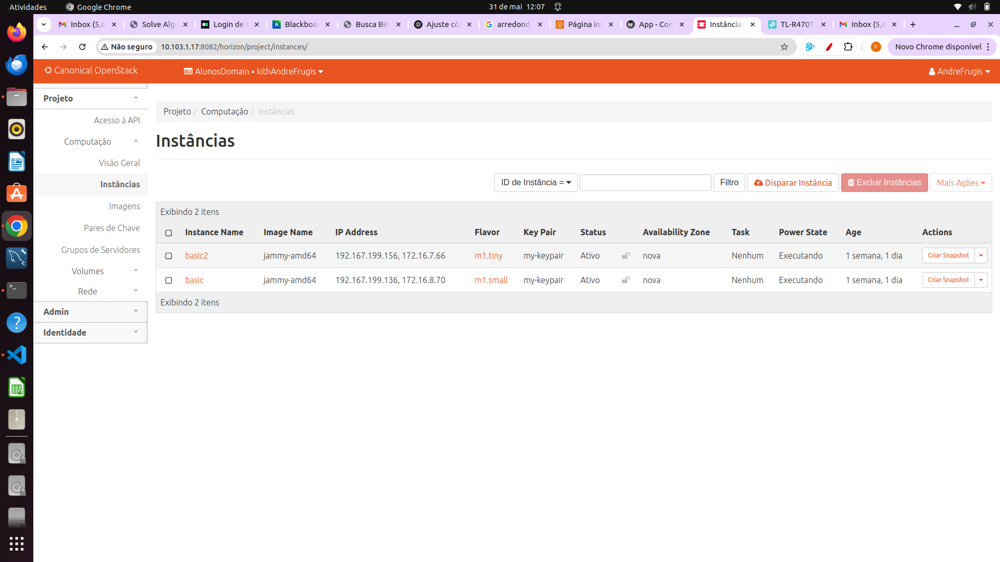
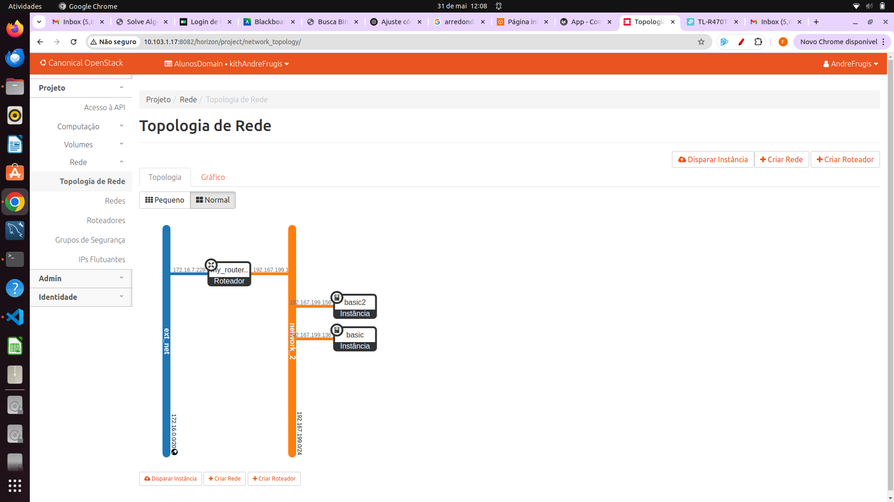
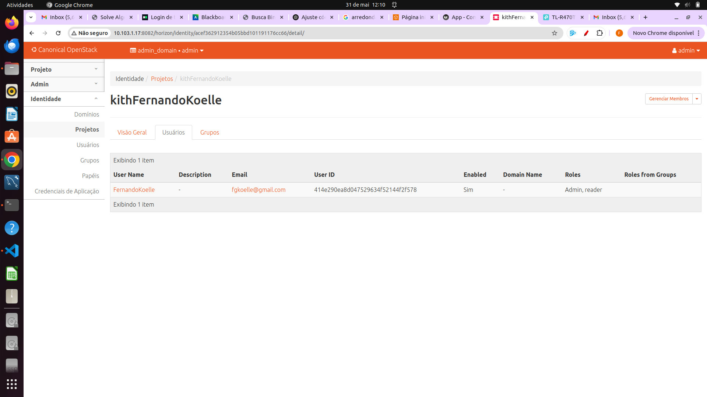
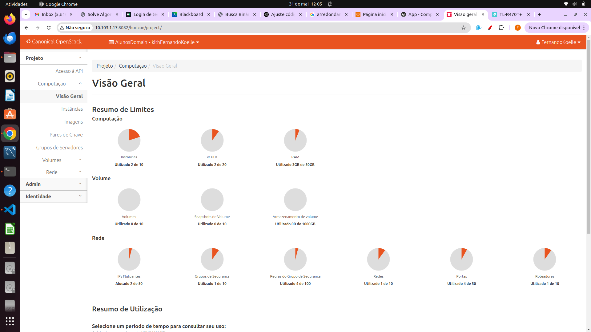
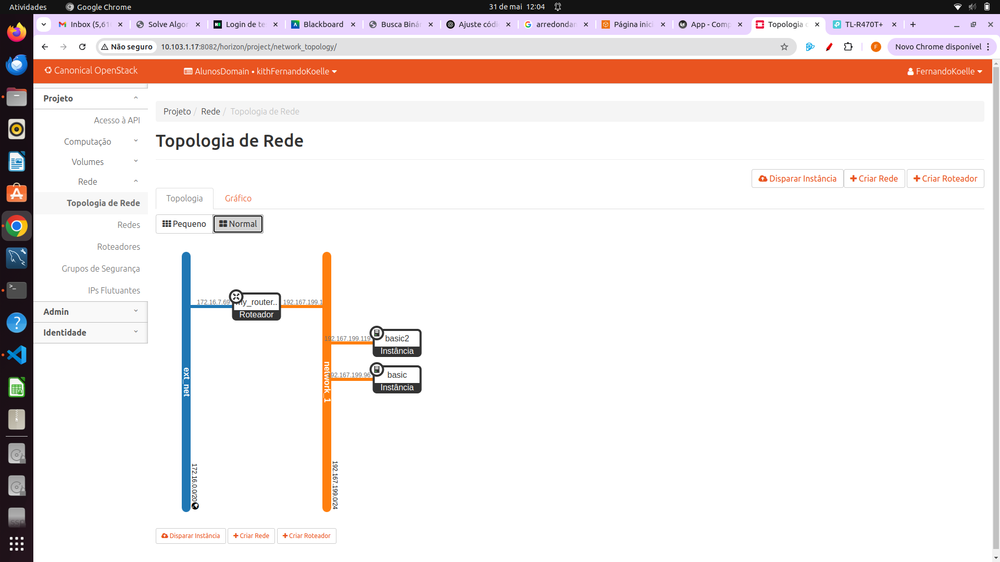

# Resultados & Evidências – Roteiro 4

Antes de apresentar os prints, vale contextualizar 🔍 —  
os dois primeiros screenshots (**Identity → Projects** e **Identity → Users** dentro de `AlunosDomain`)  
foram capturados após logarmos como **`domainAdmin`** e trocar o **Current Project** para esse domínio.  
Os demais prints (**Compute → Overview**, **Instances** e **Network → Topology**)  
foram tirados já logados como cada aluno, que possui papel **admin apenas no próprio projeto**.  
Assim, mantemos o modelo multi-tenant: cada usuário vê somente seus recursos,  
enquanto o domínio administrativo é usado exclusivamente para auditoria global.

---

## 1 · Domínio **AlunosDomain**

| Tela | Screenshot |
|------|------------|
| **Identity → Projects** |  |

---

## 2 · Aluno **Andre**

| Requisito | Screenshot |
|-----------|------------|
| **Identity → Users** |  |
| **Compute → Overview** |  |
| **Compute → Instances** |  |
| **Network → Topology** |  |

---

## 3 · Aluno **Fernando**

| Requisito | Screenshot |
|-----------|------------|
| **Identity → Users** |  |
| **Compute → Overview** |  |
| **Compute → Instances** |  |
| **Network → Topology** |  |

---
