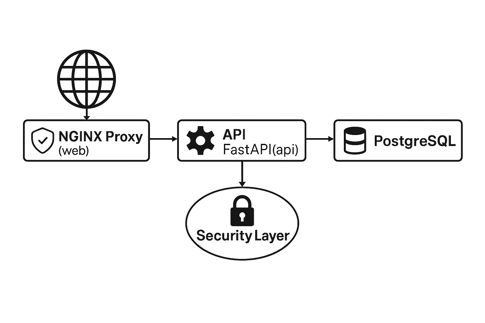

# 🛡️ Segurança e Arquitetura da Aplicação

Esta página apresenta um panorama da segurança implementada na API e da arquitetura dos serviços em Docker.

---

## 🔐 Mecanismos de Segurança

### ✅ Autenticação JWT
A autenticação é feita utilizando **JSON Web Tokens (JWT)**. Após o login, o usuário recebe um token que deve ser enviado no cabeçalho `Authorization` para acessar rotas protegidas, como `/consultar`.

```http
Authorization: Bearer <token_jwt>
```

### 🔒 Registro Protegido
A criação de novos usuários está protegida com uma **chave administrativa (`admin_secret`)**, definida no `.env`. Isso evita o registro indiscriminado por qualquer pessoa na internet.

Exemplo de body no registro:

```json
{
  "nome": "Usuário",
  "email": "usuario@email.com",
  "senha": "123",
  "admin_secret": "segredo-administrativo"
}
```

> ⚠️ Apenas usuários com o `admin_secret` correto podem registrar e obter o token JWT.

### ⚙️ Variáveis de Ambiente
Todas as credenciais sensíveis estão armazenadas no `.env` e são passadas via `docker-compose.yaml` como variáveis de ambiente, mantendo o código seguro e configurável.

---

## 🧭 Mapa de Rotas

| Rota         | Método | Protegida | Descrição                     |
|--------------|--------|-----------|-------------------------------|
| `/registrar` | POST   | ⚠️ Parcial | Protegida por `admin_secret` |
| `/login`     | POST   | ❌        | Retorna token JWT             |
| `/consultar` | GET    | ✅        | Requer token no header        |

---

## 🌐 Fluxo de Arquitetura

A aplicação é executada com Docker Compose e composta por três serviços: **NGINX (proxy reverso)**, **API (FastAPI)** e **PostgreSQL (banco de dados)**.

O fluxo pode ser representado da seguinte forma:

<p align="center">
  
</p>

---

## 🔗 Conexões

- NGINX recebe as requisições na porta 8000 e redireciona para o serviço da API.
- A API gerencia autenticação, scraping e acesso ao banco.
- O banco PostgreSQL armazena os dados dos usuários.
- Tudo roda isolado em containers e comunica-se por uma **rede Docker interna**.
