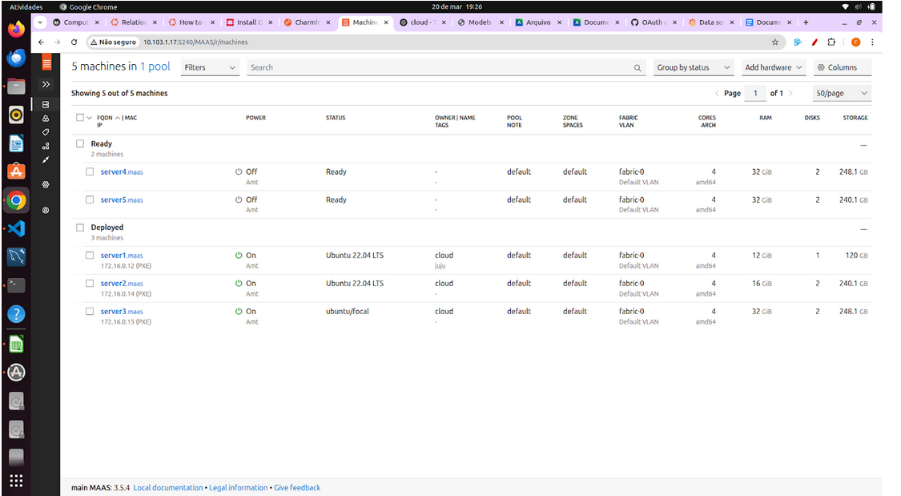
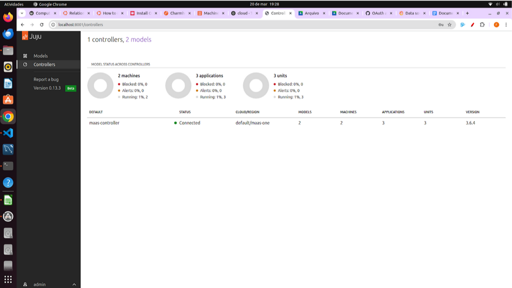
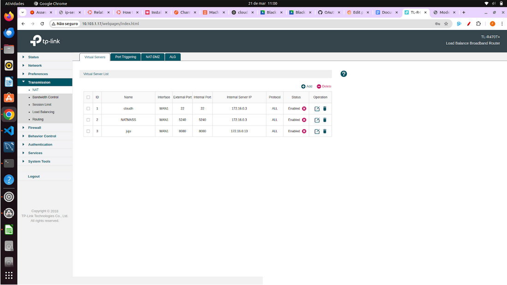

## Objetivo

Este Roteiro tem o objetivo a documentação e implementação de conceitos sobre uma plataforma de gerenciamento de software e a comunicação entre aplicativos e serviços

### Tarefa 1

### 1. De um print da tela do Dashboard do MAAS com as Maquinas e seus respectivos IPs.

### 2. De um print de tela do comando "juju status" depois que o Grafana estiver "active". 

Status do Controller: 

Status do openstack: 

### 3. De um print da tela do Dashboard do Grafana com o Prometheus aparecendo como source.

Acessado a partir de um tunelamento. Isso foi feito apos a integração com o grafana:

### 4. Prove (print) que você está conseguindo acessar o Dashboard a partir da rede do Insper.

### 5. De um print na tela que mostra as aplicações sendo gerenciadas pelo JUJU

Dashboard do JUJU - models: 

Dashboard do JUJU - controlers: 

### Extra:
Foi criado uma regra de NAT para o dashboard do JUJU - facilitar o acesso e evitar tunelamento:

### Discussões:

A instalação do Juju e sua integração com o MaaS foram relativamente tranquilas após entender a lógica de providers e credenciais. O uso do juju bootstrap para configurar o controlador exigiu atenção às tags e série correta, mas funcionou bem após a preparação. O deploy dos charms do Grafana e Prometheus foi direto, mas a integração entre eles demandou leitura cuidadosa da documentação. O acesso ao Dashboard do Grafana e a validação do Prometheus como source exigiram configuração de túnel SSH ou NAT, o que foi um ponto mais técnico. No geral, o Juju facilitou bastante o gerenciamento dos serviços distribuídos, embora o entendimento inicial da ferramenta tenha exigido um pouco mais de estudo.

### Conclusão:
O uso do Juju mostrou-se uma poderosa ferramenta de orquestração de serviços, especialmente por sua integração direta com o MaaS, permitindo deploys consistentes e escaláveis em infraestrutura bare-metal. Comparado ao Ansible, Juju vai além, assumindo também o provisionamento das máquinas. A abordagem baseada em charms simplificou o deploy do Grafana e Prometheus, e o dashboard do Juju ofereceu uma visão clara das aplicações em execução
