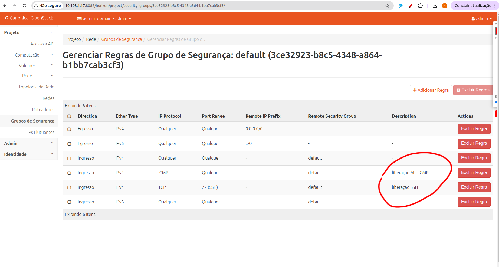

### Importe seu key-pair SSH:
   ```bash
   openstack keypair create --public-key ~/.ssh/id_rsa.pub my-key
   ```
### No Horizon, abra o security group **default** e adicione:
* **SSH** (porta 22)  
* **ALL ICMP**


---