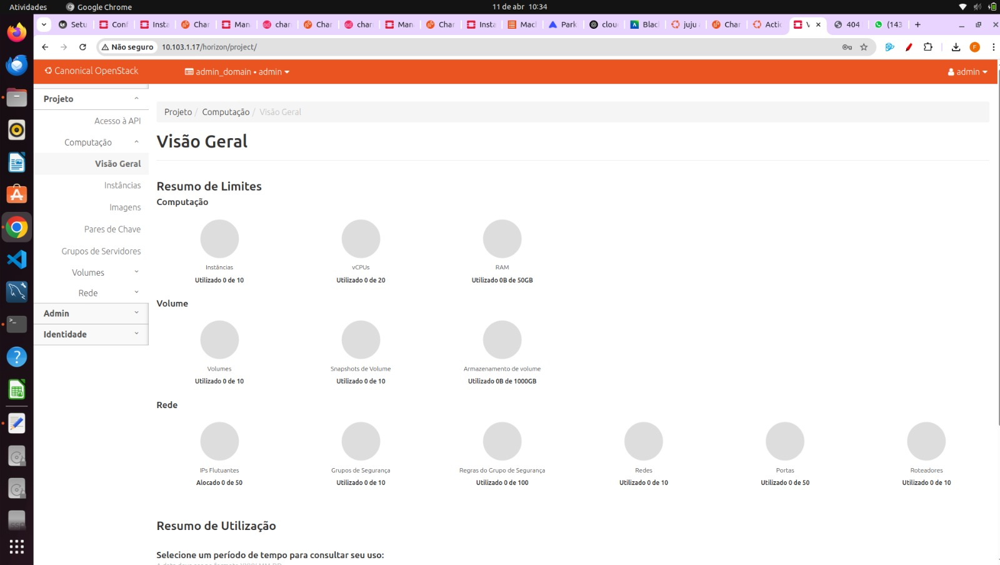
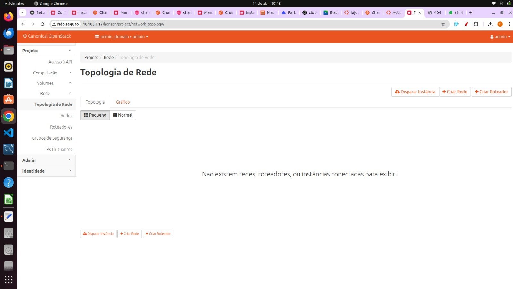
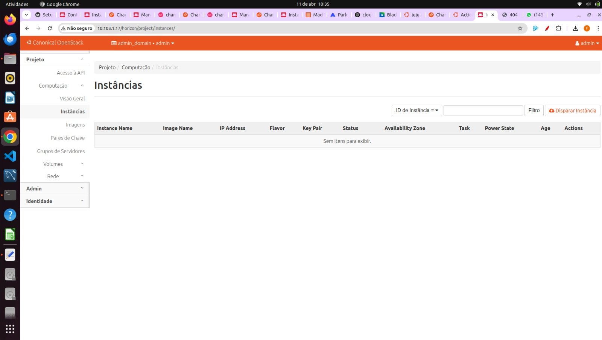

Antes de iniciar foi consultado o guia oficial de configuração do OpenStack e preparado o ambiente de trabalho.

## Configuração Inicial

**Download das credenciais (`openrc`)**  
   ```bash
   wget https://docs.openstack.org/project-deploy-guide/charm-deployment-guide/latest/_downloads/c894c4911b9572f0b5f86bdfc5d12d8e/openrc -O ~/openrc
   source ~/openrc
   ```

**Instalação do OpenStack Client**  
   ```bash
   sudo snap install openstack-client --classic
   ```

---

## Dashboard Horizon (Acesso)

Para acessar o Horizon e observar as mudanças em tempo real:

**Obter IP público do dashboard**  
   ```bash
   juju status --format=yaml openstack-dashboard \
     | grep public-address \
     | awk '{print $2}' \
     | head -1
   ```
   *Exemplo de saída:* `10.246.114.76`

**Recuperar senha de admin**  
   ```bash
   juju exec --unit keystone/leader leader-get admin_passwd
   ```

**Acessar dashboard**  
   ```
   http://10.246.114.76/horizon
   ```

**Credenciais** 
```bash 
User Name: admin  
Password: **********
Domain: admin_domain
```

### Mantenha esta aba aberta para visualizar as alterações de forma dinâmica: 

* **Overview**: 
 

* **Topologia de rede**:
 

* **Instâncias**: 
 
---


