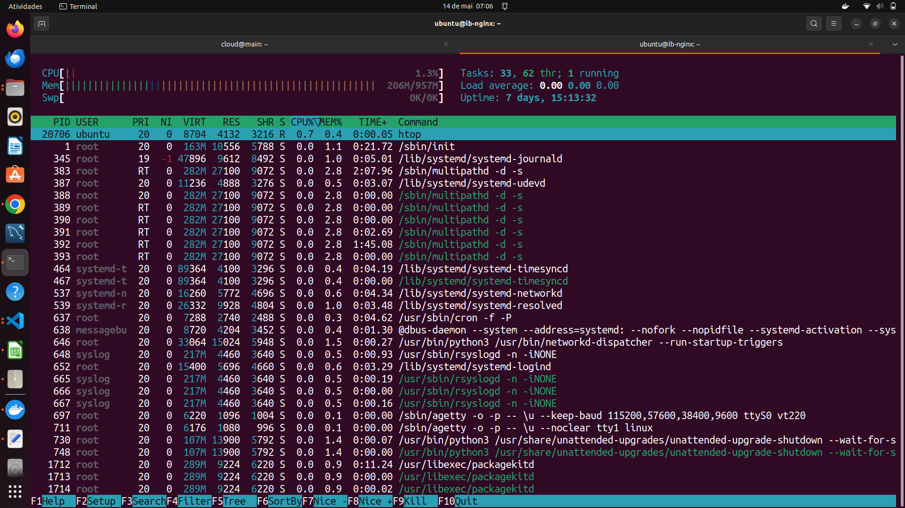
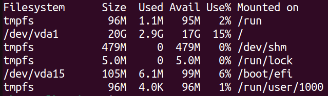
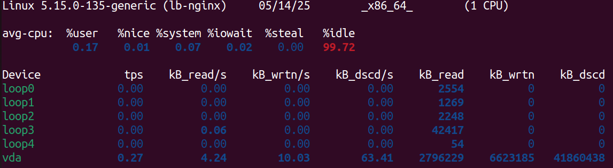

Este documento apresenta, de forma objetiva e fluida, os comandos executados dentro das instâncias para avaliar o desempenho e o processo de redimensionamento de **flavors**.

---

## 1. Coleta de Métricas nas VMs

### 1.1 Uso de CPU e Memória

```bash
htop  
```



### 1.2 Uso de Disco

```bash
df -h  
```



### 1.3 Métricas de I/O de Disco

```bash
iostat -xz 2 5  
```



---

## 2. Redimensionamento de Flavor

### 2.1 Solicitar mudança de flavor

```bash
openstack server resize --flavor <NOVO_FLAVOR> <SERVER_ID>
```

### 2.2 Verificar status do resize

```bash
openstack server list
```

```text
+--------------------------------------+---------------------+--------+-----------------------------------------+
| ID                                   | Name                | Status | Networks                                |
+--------------------------------------+---------------------+--------+-----------------------------------------+
| 67bc9a9a-5928-47c...                 | myCirrosServer      | RESIZE | admin_internal_net=192.168.111.139      |
+--------------------------------------+---------------------+--------+-----------------------------------------+
```

### 2.3 Confirmar redimensionamento

```bash
openstack server resize --confirm <SERVER_ID>
```

### 2.4 Reverter redimensionamento

```bash
openstack server resize --revert <SERVER_ID>
```

> **Observação:** Após a confirmação, a instância reinicia automaticamente com o novo flavor. Durante a migração, pode haver breve interrupção.

---

> **Espaço para print**: Comparação de métricas antes e depois do resize.