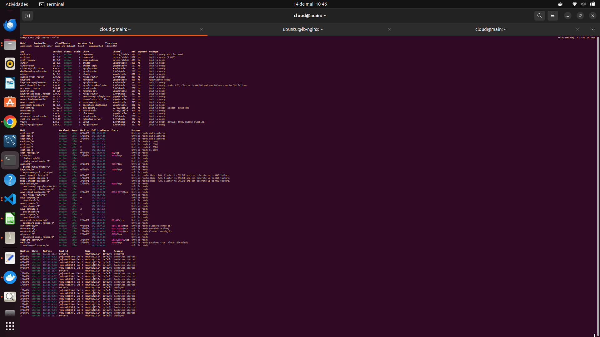
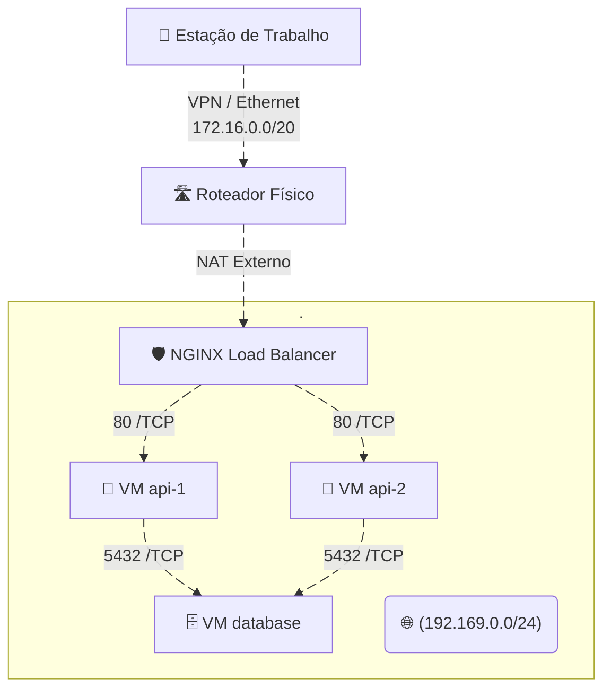

# 📈 Escalabilidade dos Nós

Escalar nós de **computação** e **block storage** no OpenStack amplia a capacidade, resiliência e desempenho do ambiente de nuvem.

---

## 🔑 Pontos‑chave

- **Capacidade de Processamento**  
  Aumento do número de instâncias simultâneas, atendendo mais usuários e aplicações.

- **Alta Disponibilidade (HA)**  
  Distribuição de cargas entre múltiplos nós reduz o impacto de falhas.

- **Desempenho e Latência**  
  Dados e processos mais próximos das VMs diminuem tempo de acesso.

- **Escalabilidade Horizontal**  
  Adicionar máquinas (versus “engordar” uma só) é mais econômico e simples de gerenciar; serviços como **Nova** e **Ceph** balanceiam cargas automaticamente.

---

## 🛠️ Comandos Utilizados

| Ação                                     | Comando |
|-----------------------------------------|---------|
| Adicionar novo nó de **compute**        | `juju add-unit nova-compute` |
| Instalar **block storage** (Ceph OSD)   | `juju add-unit --to <machine-id> ceph-osd` |

> **Passos prévios**  
> 1. Verificar no Dashboard do **MAAS** se há máquina **Allocated**.  
> 2. Fazer *release* da máquina para deixá‑la livre antes do deploy.

---

## Status do JUJU após a inserção do node:

 

## 🖼️ Diagrama de Rede (Insper → Instância)

---

