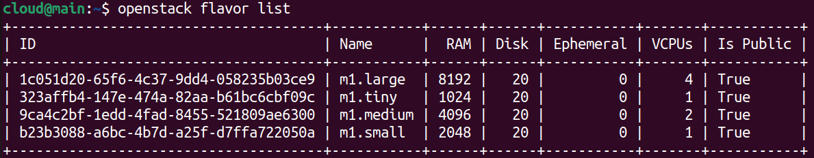

### Criação de Imagem no Glance

* Crie um diretório para as imagens:
   ```bash
   mkdir -p ~/cloud-images
   ```
* Faça o download da imagem Jammy amd64:
   ```bash
   wget http://cloud-images.ubuntu.com/jammy/current/jammy-server-cloudimg-amd64.img \
     -O ~/cloud-images/jammy-amd64.img
   ```
* Importe a imagem para o Glance:
   ```bash
   openstack image create --public --container-format bare \
     --disk-format qcow2 --file ~/cloud-images/jammy-amd64.img \
     jammy-amd64
   ```

### Criação de Flavors

Criamos sabores (flavors) ajustados para cada tipo de instância, sem incluir disco efêmero (_ephemeral disk_), pois preferimos controlar explicitamente o armazenamento persistente via Volumes Cinder.

| Nome        | vCPUs | RAM (GB) | Disk (GB) |
|-------------|-------|----------|-----------|
| m1.tiny     | 1     | 1        | 20        |
| m1.small    | 1     | 2        | 20        |
| m1.medium   | 2     | 4        | 20        |
| m1.large    | 4     | 8        | 20        |


```bash
openstack flavor create --ram 1024 --disk 20 --vcpus 1 m1.tiny
openstack flavor create --ram 2048 --disk 20 --vcpus 1 m1.small
openstack flavor create --ram 4096 --disk 20 --vcpus 2 m1.medium
openstack flavor create --ram 8192 --disk 20 --vcpus 4 m1.large
```

> **Nota:** O disco efêmero é armazenamento temporário vinculado à VM.  
> Optamos por não usar esse disco para garantir que todos os dados críticos sejam salvos em volumes permanentes via Cinder.

### Conferindo Flavors `openstack flavor list`:
 
---