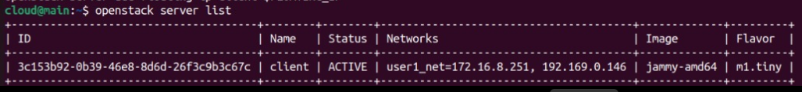
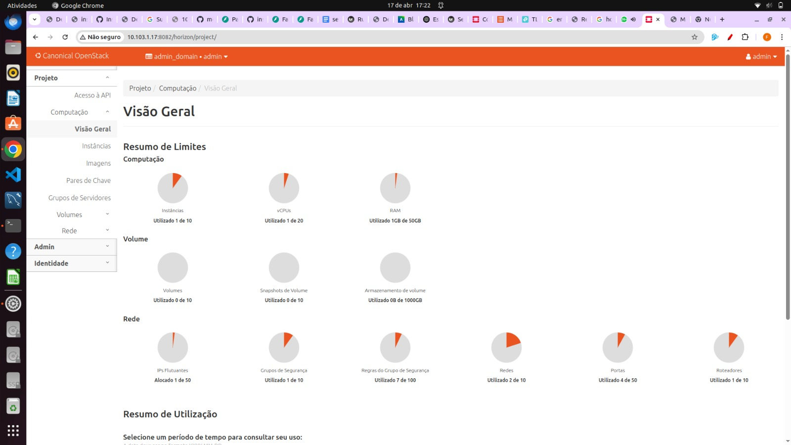
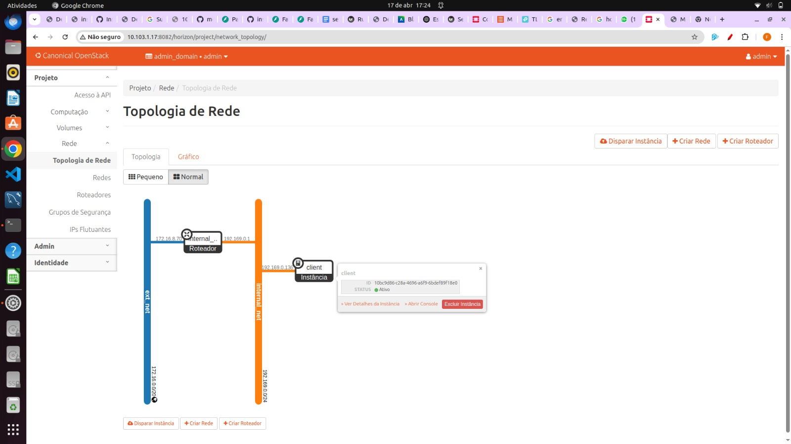

# 🚀 Lançamento de Instâncias

Esta seção descreve a criação de uma instância **client_1**, a verificação de seu estado e a atribuição de um IP flutuante.

---

### Criar a instância

```bash
openstack server create \
  --image jammy-amd64 \
  --flavor m1.tiny \
  --key-name admin \
  --network int_net \
  --security-group default \
  client_1
```

---

### Listar instâncias no projeto `project1`

```bash
openstack server list
```

**Saída de exemplo**

```
+--------------------------------------+---------+--------+---------------------------------------+-------------+----------+
| ID                                   | Name    | Status | Networks                              | Image       | Flavor   |
+--------------------------------------+---------+--------+---------------------------------------+-------------+----------+
| 627a33c8-3c55-4878-bce3-3c12fc04e4b9 | jammy-1 | ACTIVE | int_net=192.169.0.98, 10.246.116.39   | jammy-amd64 | m1.tiny  |
+--------------------------------------+---------+--------+---------------------------------------+-------------+----------+
```

---

### Atribuir IP flutuante

```bash
# Criar IP flutuante e capturar valor
FLOATING_IP=$(openstack floating ip create -f value -c floating_ip_address ext_net)

# Associar IP à instância
openstack server add floating ip client_1 $FLOATING_IP
```

Verifique novamente:

```bash
openstack server list
```

 
---

### Testar conectividade

```bash
ping $FLOATING_IP
```

Em caso de sucesso, conecte via SSH:

```bash
ssh -i ~/.ssh/id_rsa ubuntu@$FLOATING_IP
```

### Após o SetUp, podemos ver o dashboard do Horizon configurado: 

* **Overview**: 
 

* **Topologia de rede**:
 

* **Instâncias**: 
 
---

## 📊 Comparativo Antes × Depois 

| Seção                       |         **Antes**                               |  **Depois**                                                  |
|-----------------------------|----------------------------------------------------|------------------------------------------------------------------------|
| **Instâncias**              | Nenhuma instância criada (lista vazia).            | Instância **`client`** ativa <br>IPs: **192.169.0.136** (interno) / **172.16.8.69** (flutuante). |
| **Topologia de Rede**       | Diagrama vazio — sem redes, roteadores ou VMs.     | - 1 roteador ativo <br>- 2 redes (ex.: `Internal_net`, `ext_net`) <br>- Instância **`client`** conectada à rede interna. |
| **Visão Geral do Projeto**  | Todos os contadores zerados (instâncias, vCPUs, RAM, redes, roteadores, portas, regras, IPs). | - **1 / 10** instâncias usadas <br>- **1** vCPU <br>- **1 GB** de RAM <br>- **2** redes <br>- **1** roteador <br>- **4** portas <br>- **7** regras de segurança <br>- **1** IP flutuante |


