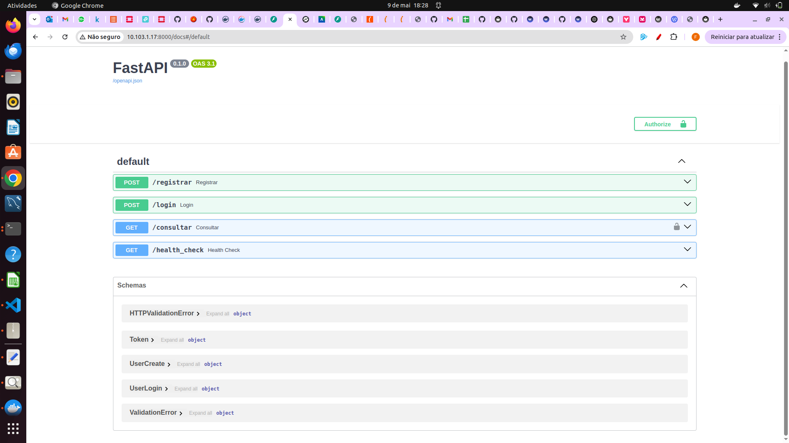
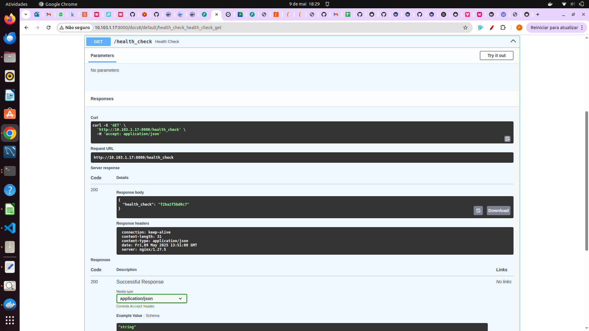

Para garantir alta disponibilidade e distribuir tráfego entre as APIs, utilizamos o NGINX em modo _reverse proxy_ com um bloco `upstream` apontando para os **IPs internos** das instâncias.

### 1. Configuração de `nginx.conf`
```nginx
http {
  upstream backend_api {
    server 192.169.0.11:8000;  # api-1 (interna)
    server 192.169.0.12:8000;  # api-2 (interna)
  }

  server {
    listen 80;
    server_name _;

    location / {
      proxy_pass http://backend_api;
      proxy_set_header Host $host;
      proxy_set_header X-Real-IP $remote_addr;
      proxy_set_header X-Forwarded-For $proxy_add_x_forwarded_for;
    }

    # Health check adicional
    location /health_check {
      proxy_pass http://backend_api/health_check;
    }
  }
}
```

### 2. `/etc/hosts`: apelidos para facilitar testes

Para permitir que o NGINX resolva `api-1` e `api-2` como nomes em vez de IPs, adicionamos no `/etc/hosts`:

```ini
# mapeamentos internos
192.169.0.220  api-1
192.169.0.134  api-2
```

Com isso, o `upstream backend_api` do `nginx.conf`::
```ini
server api-1:8000; 
server api-2:8000; 
```

### 3. Novo endpoint: `/health_check`

Para monitorar de forma ativa qual instância está respondendo, incluímos na API um endpoint simples que retorna o hostname do contêiner:

```python
from socket import gethostname
from fastapi import FastAPI

app = FastAPI()

# Endpoint para conferir o load balancer
@app.get("/health_check", status_code=200)
async def health_check():
    return {"health_check": gethostname()}
```

  

Em seguida, testamos via cliente HTTP (por exemplo, curl ou Swagger UI):

```bash
curl http://<IP_FLUTUANTE>/health_check
```

```json
{
  "health_check": "api-1"
}
```

  

> 💡 **Dica:** Você pode criar um _watch script_ ou um _Prometheus exporter_ que periodicamente acesse `/health_check` para alertar automaticamente sobre instâncias inativas.