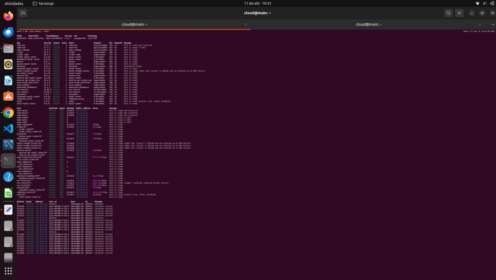
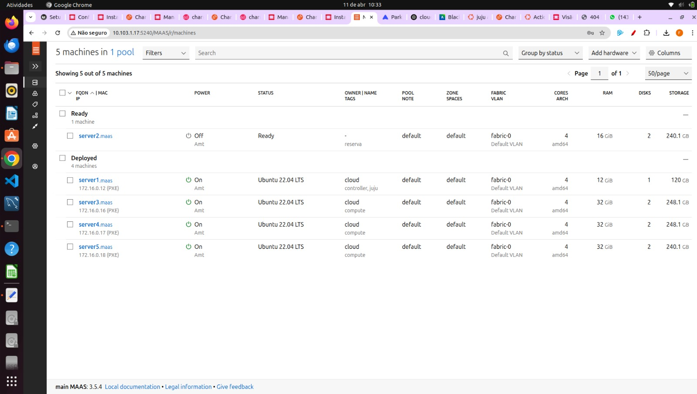

Confirmamos o estado de todos os serviços:

```bash
watch -n 1 --color "juju status --color"
```

Na saída, **Apps** devem estar `active/idle` e o **Vault** sem bloqueio.

  

O Dashboard do **MaaS** Após a criação da infraestrutura: 

  