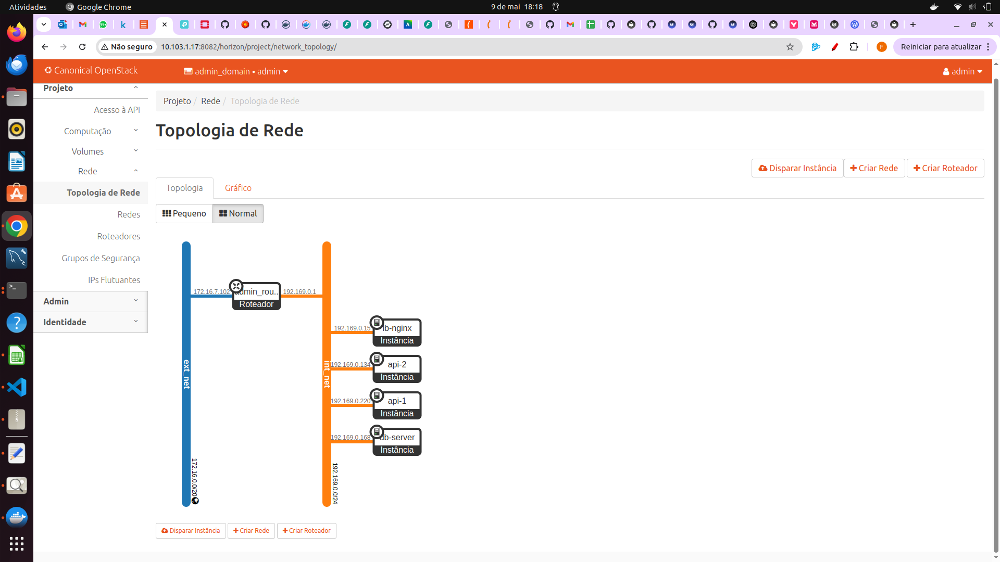
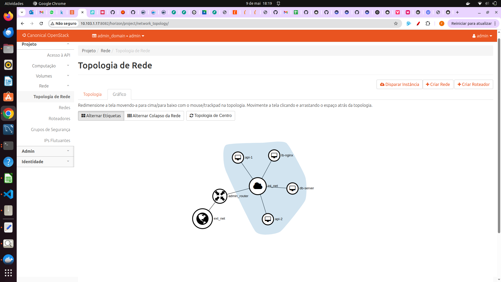
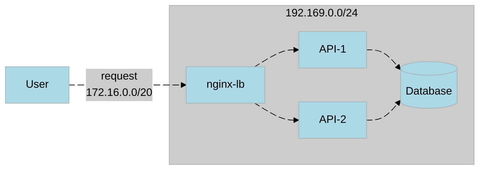
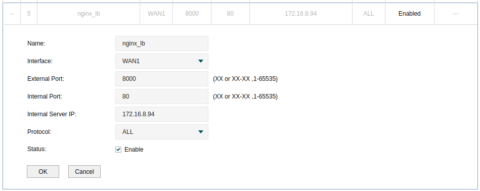

A arquitetura da aplicação foi desenhada em três camadas, isolando responsabilidades e reforçando a segurança:

- **Load Balancer (NGINX)**  
  Recebe o tráfego externo através do **IP flutuante** e distribui as requisições entre as instâncias da API.  
- **API**  
  Duas instâncias idênticas (`api-1` e `api-2`) executando a aplicação FastAPI.  
- **Banco de Dados**  
  Instância única com PostgreSQL, separada logicamente para evitar acesso direto da internet.

> 💡 **Importante:**  
> Após a instalação, **removemos o IP flutuante** das instâncias `api-1`, `api-2` e `db-server` por motivos de segurança.  
> A comunicação entre API e banco de dados passa apenas pela **rede interna** (CIDR `192.169.0.0/24`).

---

## Topologia no Dashboard do OpenStack

A interface Horizon do OpenStack oferece duas perspectivas complementares da nossa rede:

- **Modo Topologia**: mostra conexões em camadas entre redes, roteador e instâncias. 

- **Modo Gráfico**: exibe a mesma estrutura em um diagrama em cluster, facilitando a visualização do roteador central e dos nós.

### Detalhes

- **Rede Externa** (linha azul)  
  – Conecta o roteador à Internet pública; o **IP flutuante** está vinculado apenas ao NGINX.  
- **Rede Interna** (linha laranja, CIDR `192.169.0.0/24`)  
  – Isola a comunicação entre as instâncias `api-1`, `api-2` e `database`.  
- **Roteador**  
  – Faz NAT de entrada (PREROUTING) do IP flutuante para o NGINX e NAT de saída (POSTROUTING) para a Internet.  
- **Instâncias**  
  – Após a implantação, **IP flutuante removido** de `api-1`, `api-2` e `database` por segurança; elas acessam a Internet via NAT do roteador apenas quando necessário.

> 💡 **Vantagens desta visão**  
> - Confirmação imediata de sub-redes, roteadores e interfaces ativas  
> - Diagnóstico visual de gargalos na topologia  
> - Simplificação do troubleshooting sem necessidade de comandos CLI

---

## Fluxo de uma Requisição

1. O **usuário** faz uma chamada HTTP para o **IP flutuante** provisionado no NGINX.  
2. O **NGINX (load balancer)** recebe a requisição e, de acordo com sua política de balanceamento, encaminha para **api-1** ou **api-2**.  
3. A instância de API tratadora conecta-se ao **banco de dados** via **rede interna** para executar consultas ou gravações.  
4. A resposta percorre o caminho inverso até o usuário.

---

## Detalhes de Rede

- **Rede externa:**  
  - CIDR de saída NAT: `172.16.0.0/20`  
  - **IP flutuante** associado apenas ao NGINX  
- **Rede interna:**  
  - CIDR: `192.169.0.0/24`  
  - Comunicação entre `api-1`, `api-2` e `db-server` sem exposição pública  

---

## Regra de NAT para Acesso Externo

Para permitir o acesso ao seu ambiente via roteador físico sem criar túneis, configuramos uma regra de NAT no roteador:

