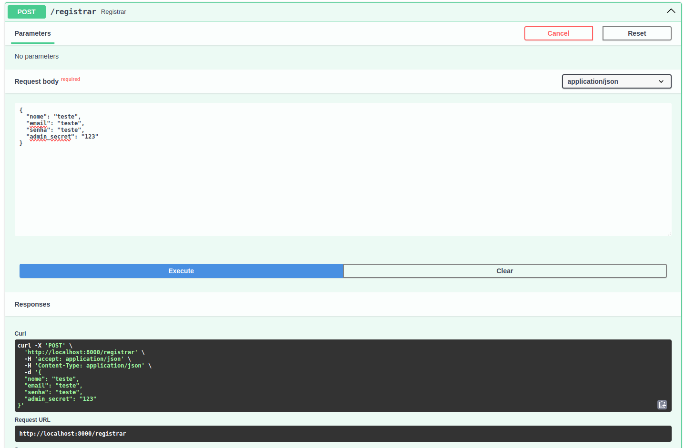
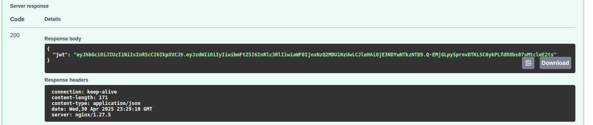
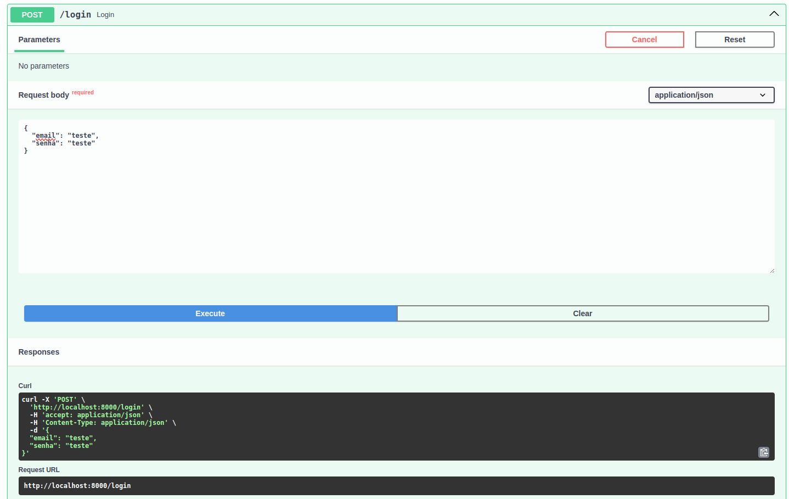
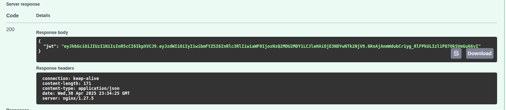
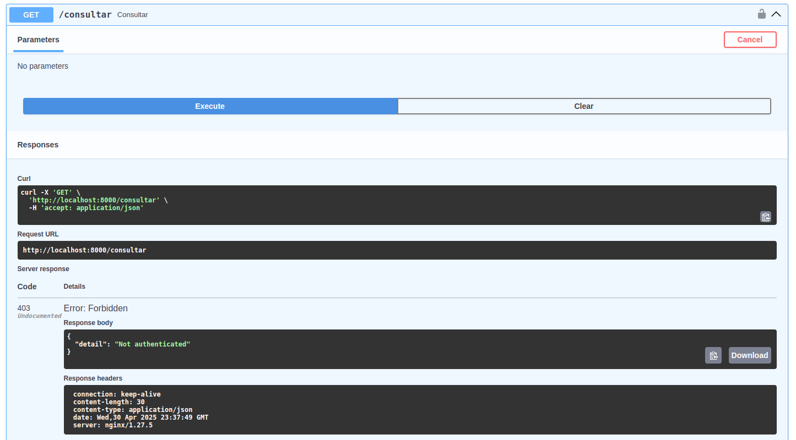
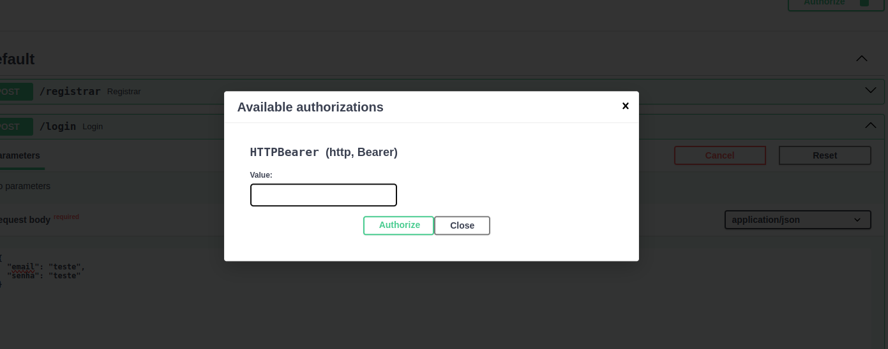
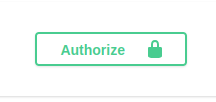
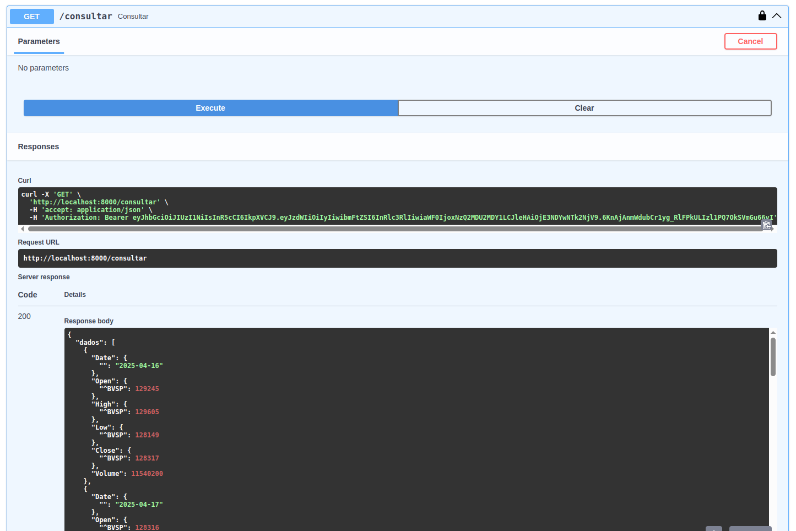

## 🔐 Registro de Usuário

Para registrar um novo usuário, envie um `POST` para `/registrar` com:

```json
{
  "nome": "Seu Nome",
  "email": "seu@email.com",
  "senha": "suasenha",
  "admin_secret": "segredo-administrativo"
}
```

> ⚠️ O campo `admin_secret` é obrigatório e deve coincidir com o valor da variável `ADMIN_SECRET`.

### 📤 Requisição de Registro



---

### 📥 Resposta Esperada



---

## 🔑 Login

Envie um `POST` para `/login` com:

```json
{
  "email": "seu@email.com",
  "senha": "suasenha"
}
```

Você receberá um token JWT. Exemplo:

```json
{
  "jwt": "eyJhbGciOiJIUzI1NiIsInR5cCI6IkpXVCJ9..."
}
```

### 📤 Requisição de Login



---

### 📥 Resposta com Token



---

---

## 🔎 Consulta (Rota Protegida)

Para acessar a rota `/consultar`, inclua o JWT no cabeçalho da requisição:

```
Authorization: Bearer <seu_token_jwt>
```

---

## ⚠️ Erros comuns e uso correto do token JWT

Ao testar via navegador, é comum esquecer de incluir o token JWT, o que resulta em erro de autenticação.

### ❌ Tentativa de acesso sem autenticação



---

### 🔐 Onde adicionar o token recebido no login

No campo **Authorization**, selecione o tipo `Bearer` e cole o token JWT retornado:



---

### 🔒 Como identificar que o token foi adicionado corretamente

Se o token estiver presente, um **ícone de cadeado fechado** deve aparecer na interface:



---

### ✅ Consulta bem-sucedida após autenticação

Após o token ser corretamente inserido, a requisição protegida `/consultar` retorna os dados esperados:



</details>
